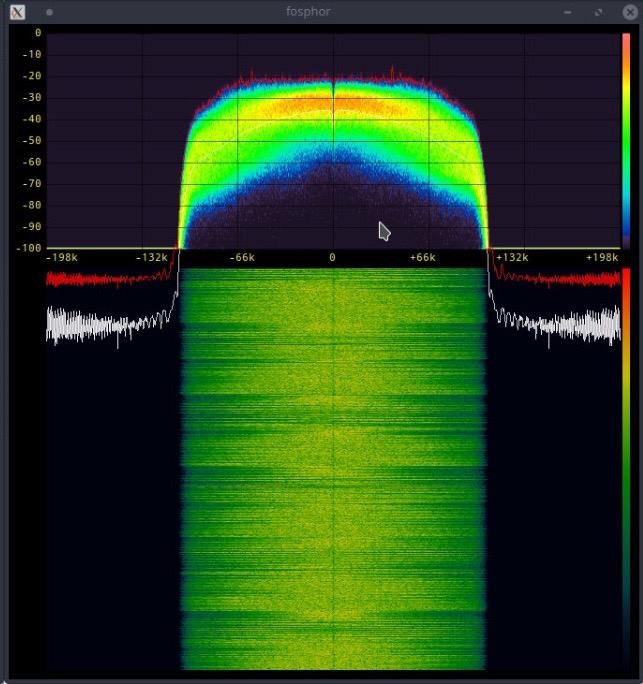
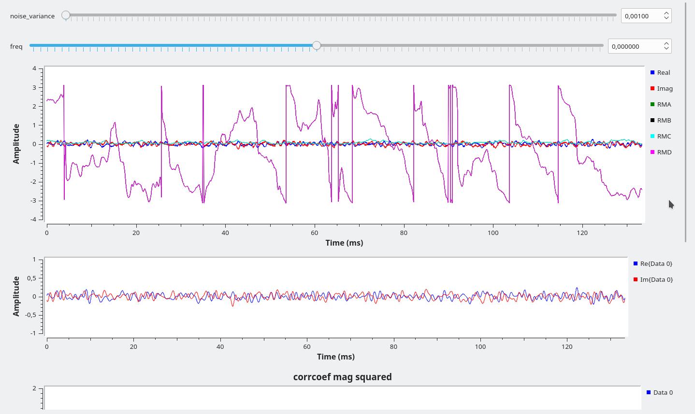

# Bitacora GNUradio
Bitacora del trabajo realizado con GNUradio en el grupo i2t 

## ¿Qué es GNUradio? 

[GNUradio](https://www.gnuradio.org/) es un software [opensource](https://opensource.com/resources/what-open-source) para el procesamiento de señales, para la instalación de este en Ubuntu 18.04 LTS via pybombs puede revizar el siguiente [enlace](pages/pybombs.md)

## Trabajo con FM 

### Receptor de FM

El primer proyecto trabajado con GNUradio fue el relacionado con FM para este primer
proyecto se consulto con diferentes fuentes biográficas entre ellas la de la página oficial de GNU Radio, principalmente.

Para el primer proyecto, se planteo la implementación de un receptor de FM, se recomienda que para esta parte se familiarice con la interfaz de GNU Radio companion, para esto puede revisar el siguiente [enlace](https://wiki.gnuradio.org/index.php/Tutorials), el resultado final de este trabajo con la USRP B200 y la librería grafica gr-fosphor: 

### Transmisor FM 

La segunda parte del proyecto consistió en la implementación del transmisor de FM para el cual se utilizó la USRP B200, para esto se partio de la idea de recrear el proceso inverso del trabajo anterior. 

## Trabajo con DRM (digital Radio Moundiale)

### fase de transmisión 

para la primera parte de esta sección se comenzó con la integración de la libreria
[gr-drm](https://github.com/kit-cel/gr-drm) creada por [KIT](https://www.kit.edu/english/), después de haber instalado la librería se trabajo en base este
 [documento](documentos/drm_transmitter_gnuradio.pdf) para crear el flujo en GNUradio el resultado de este trabajo fue [este](documentos/drm-transmiter.grc), después de esto se 
buscó diferentes [archivos de audio](audio_sources) para probar la transmisión.

Se comprobó con ayuda del analizador de señales que efectivamente la transmisión de la 
señal fue exitosa y se procedió con la siguiente fase   

### fase de recepción 

para esta fase se uso la rama del proyecto [gr-drm](https://github.com/kit-cel/gr-drm) llamada `drmrx` para que el receptor y el transmisor funcionaran en conjunto con el mismo proyecto se tiene que hacer: 

1. clonar el proyecto en la carpeta de instalación 
2. cambiar la rama del proyecto a `drmrx`
3. hacer `merge` entre las ramas `drmrx` y `master` 
4. instalar la librería 

una vez instalada el resultado de la recepción fue el siguiente: 

### Sugerencias: 

1. Al ejecutar gnuradio-companion hagalo con: `pybombs run gnuradio-companion` para que todas las librerías funcionen de forma correcta (asegurandose estar ejecuando el prefix de gnuradio-3.7)
